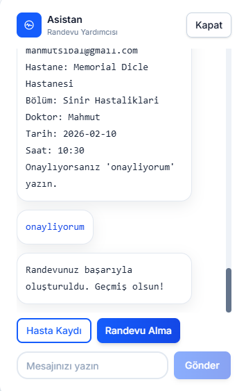
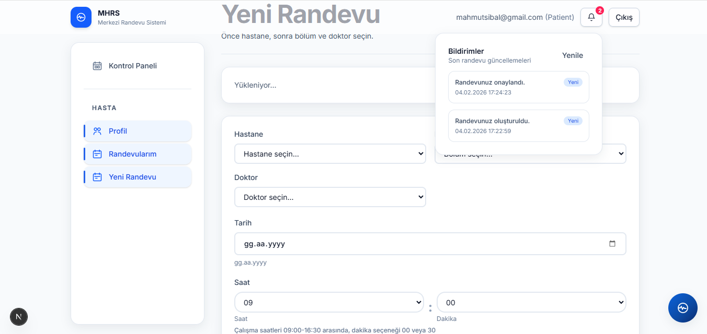
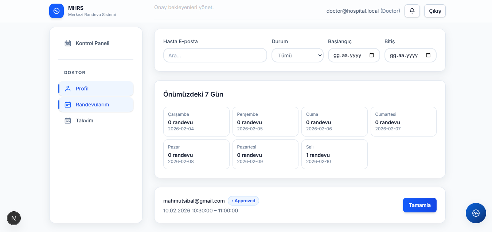
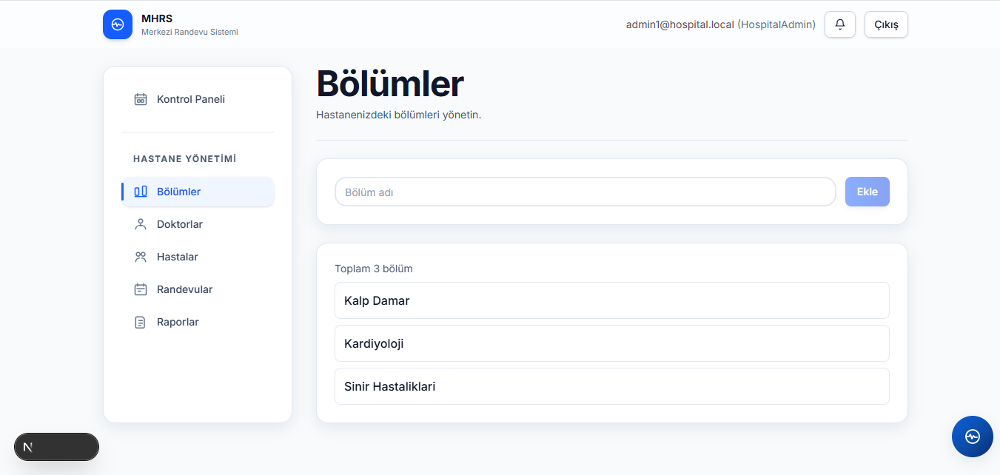
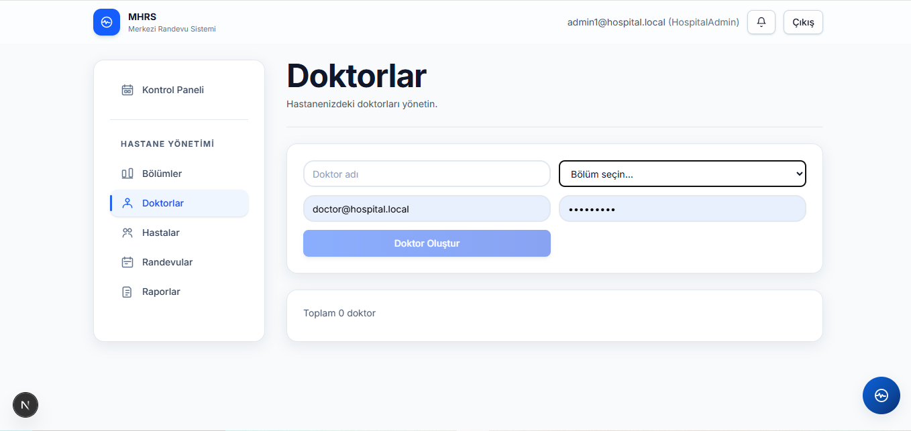
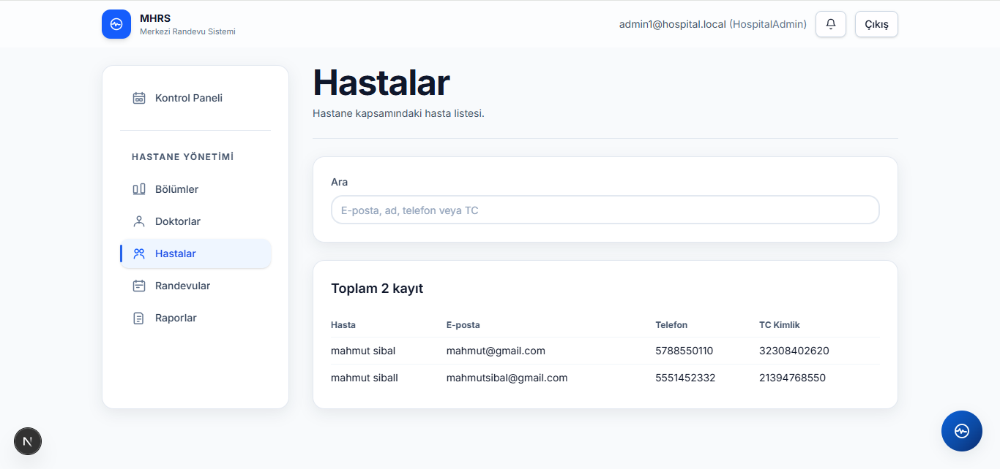
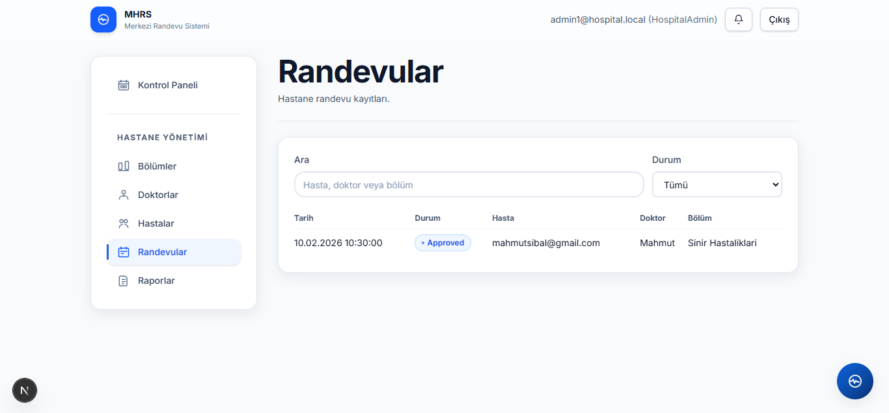
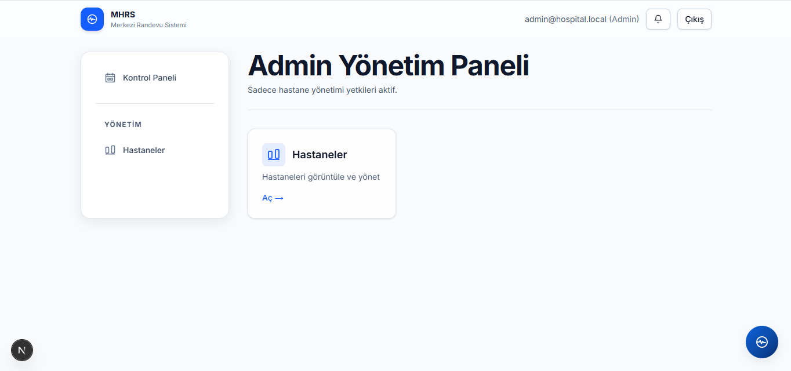

# MHRS – Merkezi Hastane Randevu Sistemi

Modern, ölçeklenebilir ve güvenli bir hastane randevu yönetim platformu. Çok rollü erişim (Hasta, Doktor, Hastane Yöneticisi, Admin), JWT tabanlı kimlik doğrulama, güçlü kurallar ve sezgisel bir Next.js arayüzü ile gelir.

### Dokümantasyon
- Ayrıntılı açıklama: [docs/MHRS-Nedir-ve-Bu-Sistemi-Neden-Kullanmalisiniz.md](docs/MHRS-Nedir-ve-Bu-Sistemi-Neden-Kullanmalisiniz.md)

---

## Özellikler

- **Roller:** Patient, Doctor, HospitalAdmin, Admin
- **Randevu Yönetimi:** Alma, listeleme, iptal (kurallı), doktor onayı/tamamlama
- **Katalog:** Hastaneler (konum bazlı), bölümler, doktorlar
- **Raporlar:** En popüler doktorlar (Chart.js görselleştirme)
- **AI Asistan:** Gemini destekli konuşarak randevu alma
- **Haritalar:** Google Maps ile yakın hastaneler/işaretçiler
- **Güvenlik:** JWT + Refresh, rol/policy, rate limiting, global hata yakalama
- **Dev Deneyimi:** Otomatik EF migrasyonları, Swagger, Serilog loglama

---

## Mimari

- **Backend:** .NET 8 Web API (Clean Architecture)
  - Katmanlar: WebApi, Application, Infrastructure, Domain
  - Önemli giriş noktası: [WebAppointment.Api/WebAppointmentApi.WebApi/Program.cs](WebAppointment.Api/WebAppointmentApi.WebApi/Program.cs)
  - Global hata yakalama: [WebAppointment.Api/WebAppointmentApi.WebApi/Middleware/ExceptionHandlingMiddleware.cs](WebAppointment.Api/WebAppointmentApi.WebApi/Middleware/ExceptionHandlingMiddleware.cs)
  - Controller örnekleri: [WebAppointment.Api/WebAppointmentApi.WebApi/Controllers](WebAppointment.Api/WebAppointmentApi.WebApi/Controllers)
- **Frontend:** Next.js 16 + React 19 + TypeScript
  - App Router ile sayfalar: [WebAppointment.Frontend/src/app](WebAppointment.Frontend/src/app)
  - Proxy + session API’leri: [WebAppointment.Frontend/src/app/api](WebAppointment.Frontend/src/app/api)
  - Rol korumalı middleware: [WebAppointment.Frontend/middleware.ts](WebAppointment.Frontend/middleware.ts)

---

## Backend – Ayrıntılar

- **Multi-tenant (SaaS Temeli)**
  - Tüm ana tablolar `TenantId` içerir ve istek başına tenant global filtre ile sınırlandırılır.
  - JWT içinde `tenant_id` claim’i yer alır; yoksa `MultiTenancy:DefaultTenantId` (varsayılan 1) kullanılır.
  - Admin/HospitalAdmin kullanıcılar sadece kendi tenant verisini görür.
  - İlgili kodlar: [WebAppointmentApi.Domain/Common/IMultiTenant.cs](WebAppointment.Api/WebAppointmentApi.Domain/Common/IMultiTenant.cs), [AppDbContext](WebAppointment.Api/WebAppointmentApi.Infrastructure/Data/AppDbContext.cs), [JwtTokenService](WebAppointment.Api/WebAppointmentApi.Infrastructure/Security/JwtTokenService.cs), [TenantContext](WebAppointment.Api/WebAppointmentApi.WebApi/Security/TenantContext.cs).

- **Audit Log (KVKK Uyumlu)**
  - Değişiklikler otomatik izlenir: Kim (UserId/Role), Ne zaman, Hangi Entity, Önce/Sonra, IP.
  - Kayıtlar `AuditLogs` tablosuna yazılır (SaveChanges içinde interceptor).
  - İlgili kodlar: [AuditLog](WebAppointment.Api/WebAppointmentApi.Domain/Entities/AuditLog.cs), [AppDbContext.SaveChangesAsync](WebAppointment.Api/WebAppointmentApi.Infrastructure/Data/AppDbContext.cs).

- **Kimlik Doğrulama & Yetki**
  - JWT Access (15 dk) + Refresh (30 gün) – ayarlar: [WebAppointment.Api/WebAppointmentApi.WebApi/appsettings.json](WebAppointment.Api/WebAppointmentApi.WebApi/appsettings.json)
  - Roller: Patient, Doctor, Admin, HospitalAdmin (bkz. [WebAppointment.Api/WebAppointmentApi.Domain/Enums/UserRole.cs](WebAppointment.Api/WebAppointmentApi.Domain/Enums/UserRole.cs))
  - Özel politika: "DoctorProfile" – doktorun ilişkili profili olmalı
  - Gelişmiş politika: `CanManageDepartment` (departman yönetimi tenant eşleşmesiyle kısıtlanır)
- **Randevu Akışı (Hasta)**
  - Oluştur: `POST /api/appointments`
  - Liste: `GET /api/appointments/my`
  - İptal: `PUT /api/appointments/{id}/cancel`
  - Kurallar: geçmiş/başlamaya 15 dk kala iptal edilemez; 30 dk sabit süre; çakışma önleme
- **Doktor Akışı**
  - Liste: `GET /api/doctor/appointments/my`
  - Onay: `PUT /api/doctor/appointments/{id}/approve`
  - Tamamla: `PUT /api/doctor/appointments/{id}/complete`
  - Takvim slotları: `GET /api/doctor/calendar/daily-slots?date=YYYY-MM-DD`
- **Katalog**
  - Hastaneler: `GET /api/catalog/hospitals` (opsiyonel lat/lng/take)
  - Bölümler: `GET /api/catalog/departments?hospitalId={id}`
  - Doktorlar: `GET /api/catalog/doctors?departmentId={id}`
- **Hastane Yöneticisi**
  - Bölümler: CRUD `api/hospitaladmin/departments`
  - Doktorlar: CRUD `api/hospitaladmin/doctors`
- **Admin**
  - Tam kapsam CRUD controller’ları (Doktor yönetimi artık HospitalAdmin panelindedir)
  - Raporlar: `GET /api/admin/reports/top-doctors?days=30&take=10`
- **Altyapı**
  - Rate limiting (dakikada 60 istek)
  - Serilog request logging
  - FluentValidation + ProblemDetails hata çıktısı
  - EF Core, otomatik migrasyon (startup’ta)

> Entity’ler ve durumlar için örnekler: [WebAppointment.Api/WebAppointmentApi.Domain/Entities](WebAppointment.Api/WebAppointmentApi.Domain/Entities) ve [WebAppointment.Api/WebAppointmentApi.Domain/Enums](WebAppointment.Api/WebAppointmentApi.Domain/Enums)

---

## Frontend – Ayrıntılar

- **Route Koruması**: [WebAppointment.Frontend/middleware.ts](WebAppointment.Frontend/middleware.ts) JWT cookie’lerine göre `/admin`, `/doctor`, `/patient`, `/app` alanlarını korur.
- **Session & Proxy**
  - Backend origin seçimi: [WebAppointment.Frontend/src/lib/backend.ts](WebAppointment.Frontend/src/lib/backend.ts)
  - JSON istemci: [WebAppointment.Frontend/src/lib/api-client.ts](WebAppointment.Frontend/src/lib/api-client.ts)
  - Backend proxy: [WebAppointment.Frontend/src/app/api/backend/[...path]/route.ts](WebAppointment.Frontend/src/app/api/backend/%5B...path%5D/route.ts)
  - Login/Register/Logout: [WebAppointment.Frontend/src/app/api/session](WebAppointment.Frontend/src/app/api/session)
- **Ekranlar**
  - Hasta: [WebAppointment.Frontend/src/app/(app)/patient](WebAppointment.Frontend/src/app/(app)/patient)
    - Yeni randevu: [WebAppointment.Frontend/src/app/(app)/patient/appointments/new/page.tsx](WebAppointment.Frontend/src/app/(app)/patient/appointments/new/page.tsx)
  - Doktor: [WebAppointment.Frontend/src/app/(app)/doctor](WebAppointment.Frontend/src/app/(app)/doctor)
    - Randevular: [WebAppointment.Frontend/src/app/(app)/doctor/appointments/page.tsx](WebAppointment.Frontend/src/app/(app)/doctor/appointments/page.tsx)
  - Hastane Yöneticisi: [WebAppointment.Frontend/src/app/(app)/hospital](WebAppointment.Frontend/src/app/(app)/hospital)
    - Bölümler: [WebAppointment.Frontend/src/app/(app)/hospital/departments/page.tsx](WebAppointment.Frontend/src/app/(app)/hospital/departments/page.tsx)
  - Admin: [WebAppointment.Frontend/src/app/(app)/admin](WebAppointment.Frontend/src/app/(app)/admin)
    - Raporlar: [WebAppointment.Frontend/src/app/(app)/admin/reports/page.tsx](WebAppointment.Frontend/src/app/(app)/admin/reports/page.tsx)
    - Not: Admin doktor yönetimi kaldırılmıştır; doktor ekleme/güncelleme sadece HospitalAdmin tarafındadır.
- **Harita Bileşeni**: [WebAppointment.Frontend/src/components/map/HospitalMap.tsx](WebAppointment.Frontend/src/components/map/HospitalMap.tsx)
- **AI Asistan**: [WebAppointment.Frontend/src/components/assistant/AssistantWidget.tsx](WebAppointment.Frontend/src/components/assistant/AssistantWidget.tsx) ve API: [WebAppointment.Frontend/src/app/api/assistant/chat/route.ts](WebAppointment.Frontend/src/app/api/assistant/chat/route.ts)

---

## Kurulum

### Önkoşullar
- .NET 8 SDK
- Node.js 20+ ve pnpm/npm/yarn (örn. npm)
- SQL Server (LocalDB/Developer/Container), `localhost` erişilebilir
- Opsiyonel: Google Maps ve Gemini API anahtarları

### Test ve Kalite Kontrolleri

Backend testleri:

```powershell
cd WebAppointment.Api
dotnet test
```

Frontend kalite kontrolleri:

```powershell
cd WebAppointment.Frontend
npm run lint
```

### Backend’i Çalıştırma

```powershell
# Proje kökünden Web API klasörüne geçin
cd WebAppointment.Api/WebAppointmentApi.WebApi

# Bağımlılıkları geri yükleyin ve çalıştırın
dotnet restore
dotnet run
# Varsayılan URL: http://localhost:5233  (bkz. Properties/launchSettings.json)
```

- Veritabanı bağlantısı: [WebAppointment.Api/WebAppointmentApi.WebApi/appsettings.json](WebAppointment.Api/WebAppointmentApi.WebApi/appsettings.json)
  - `ConnectionStrings:DefaultConnection` değerini kendi SQL Server ortamınıza göre güncelleyin.
  - `Jwt:SigningKey` değerini en az 32 karakterlik güçlü bir gizli anahtar ile değiştirin.
- İlk açılışta otomatik migrasyon uygulanır. Swagger: `http://localhost:5233/swagger`

> Not: Şemaya (TenantId/AuditLog vb.) yeni alanlar eklendi. Gerekirse EF migration üretip uygulayın:

```powershell
# Migration oluşturma (Infrastructure projesi context’i içerir)
cd ..\WebAppointmentApi.Infrastructure
dotnet ef migrations add MultiTenant_Audit_Initial --startup-project ..\WebAppointmentApi.WebApi --project .
dotnet ef database update --startup-project ..\WebAppointmentApi.WebApi --project .
```

### Frontend’i Çalıştırma

```powershell
# Proje köküne dönün ve frontend klasörüne geçin
cd ..\..\WebAppointment.Frontend

# Bağımlılıkları kurun
npm install

# Geliştirme sunucusunu başlatın
npm run dev
# Varsayılan URL: http://localhost:3000
```

### Ortam Değişkenleri

Frontend `.env.local` örneği:

```
# Backend Web API adresi
BACKEND_ORIGIN=http://localhost:5233

# Opsiyonel – Google Gemini
GEMINI_API_KEY=your_gemini_key

# Opsiyonel – Google Maps
NEXT_PUBLIC_GOOGLE_MAPS_API_KEY=your_maps_key
```

> Frontend, backend’e `/api/backend/...` proxy’si ile gider; `BACKEND_ORIGIN` bu yüzden kritiktir.

Backend `appsettings.json` çok-kiracılık örneği:

```
"MultiTenancy": {
  "DefaultTenantId": 1
}
```

---

## Hızlı Deneme Senaryoları

- **Hasta Kaydı & Giriş**
  1) `/register` üzerinden kayıt ol veya `/login` ile giriş yap
  2) `/patient/appointments/new` alanından hastane → bölüm → doktor → tarih/saat seçip randevu oluştur
- **Doktor Onayı**
  1) Doktor olarak giriş yap
  2) `/doctor/appointments` ekranından bekleyen randevuyu **Onayla** ardından **Tamamla**
- **Raporlar (Admin)**
  1) Admin olarak giriş yap
  2) `/admin/reports` ekranından filtreleri kullanarak en popüler doktorları gör

---

## Güvenlik Notları

- HttpOnly cookie’ler: `mhrs_at` (access), `mhrs_rt` (refresh)
- Role-based guard: Frontend middleware ile hassas route’lar korunur
- Rate limit: kullanıcı/IP bazlı kısıtlama
- ProblemDetails ile tutarlı hata formatı; frontend `apiJson` bunları kullanıcı dostu mesaja çevirir
- Rate limiting, JWT secret ve bağlantı dizileri gibi kritik değerleri production ortamında bir secret manager üzerinden yönetin.

---

## Katkı Rehberi (CONTRIBUTING)

- Yeni özellikler için küçük, odaklı branch’ler açın.
- PR’larda değişiklik amacı, test sonuçları ve olası riskleri netçe belirtin.
- Kodunuzu göndermeden önce ilgili test/kalite kontrollerini çalıştırın.

## Sık Karşılaşılan Sorunlar

- "Bağlantı sağlanamıyor": SQL Server servisinin çalıştığını ve `DefaultConnection` değerinin doğru olduğunu doğrulayın.
- 401/403 hataları: Rol ve token geçerliliğini kontrol edin. Proxy route otomatik refresh dener.
- Saat dilimi: Frontend, randevu gönderiminde Türkiye saati için `+03:00` ekler; backend tüm tarihleri UTC olarak saklar.

---

## Lisans

Bu proje MIT lisansı ile sunulmaktadır. Ayrıntılar için `LICENSE` dosyasına bakınız.

---

## Screenshots

Sistemin güncel ekran görüntüleri ve kısa açıklamaları aşağıdadır:

### Giriş Ekranı

_Kullanıcıların e-posta/şifre ile oturum açtığı ekran. Başarılı giriş sonrası rolüne göre yönlendirme yapılır._

### Hasta Kayıt Ekranı

_Yeni hasta kaydı için kimlik bilgileri ve iletişim bilgileri girilir; doğrulamalar anlık olarak uygulanır._

### Ana Dashboard Ekranı

_Rol bazlı özet kartları ve hızlı erişimler. Son randevular, bekleyen onaylar ve kısa yollar görüntülenir._

### Asistan Ekranı

_AI asistan ile doğal dilde etkileşim kurarak randevu arama/oluşturma akışına destek sağlar._

### Hasta – Yeni Randevu Ekranı

_Hasta, hastane → bölüm → doktor → tarih/saat adımlarında seçim yaparak randevu oluşturur. Çakışmalar ve kurallar kontrol edilir._

### Doktor – Randevularım

_Doktorun kendisine atanmış randevuları listeler. Randevu **Onayla** ve **Tamamla** işlemleri buradan yapılır._

### Doktor – Takvim

_Günlük/haftalık zaman dilimleri ve uygun slotlar gösterilir; yoğunluk planlaması yapılır._

### Hastane Yönetimi – Genel

_Hastane yöneticisi için üst seviye kontrol paneli; bölümler, doktorlar ve randevulara hızlı erişim._

### Hastane – Bölümler

_Bölüm CRUD işlemleri: ekleme, düzenleme, silme ve listeleme. Tenant kısıtları otomatik uygulanır._

### Hastane – Doktorlar

_Doktor yönetimi: atama, profil düzenleme ve bölüm/çalışma takvimi ilişkileri._

### Hastane – Hastalar

_Hastane kapsamındaki hastaların listesi ve temel demografik/iletişim bilgileri._

### Hastane – Randevular

_Hastane genelindeki randevuların takibi; filtreleme ve durum yönetimi._

### Admin – Yönetim

_Sistem geneli yönetim ve raporlara erişim. Tenant, kullanıcı ve güvenlik politikaları üzerinde tam yetki._

---

## İletişim

- İsim: Mahmut Sibal
- GitHub: [MahmutSibal](https://github.com/MahmutSibal)
- E-posta: [mahmutsibal9@gmail.com](mailto:mahmutsibal9@gmail.com)
